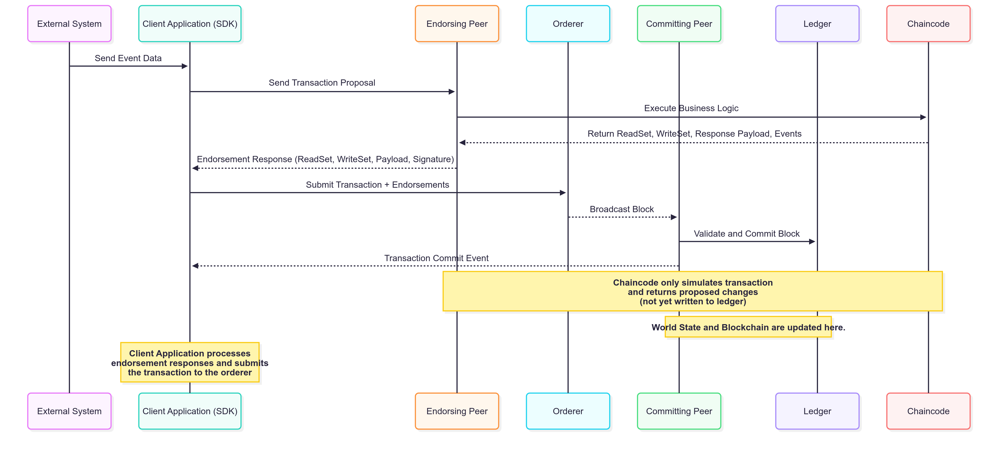

**Overview: Two Organizations (Org1 and Org2) Sharing a Single Private Channel with Shared SmartContract**

- CA (Certificate Authority): Issues X.509 certificates for Clients, Peers, and Orderers.
- MSP (Membership Service Provider): Manages identities and authenticates access within each organization.
- Organization 1, Organization 2: Own Peers (Endorsers and Committers) and MSPs.
- Endorser Peer: Executes smart contract and generates read-write sets.
- Committer Peer: Validates transactions and updates the ledger.
- Channel: A private communication space that contains SmartContract (business logic) and Ledger (blockchain + world state).
- Orderer: Orders transactions and distributes blocks.
- SmartContract: Installed on Endorser Peers, instantiated on the channel, processes event data, and emits events.
- Ledger: Stores the blockchain (transaction history) and the world state (current state).

**Detailed Workflow**

1. **Identity Enrollment via CA**
   - The client (user or service) registers with the Certificate Authority (CA).
   - The CA issues a digital certificate (X.509).
   - The client's identity is managed by the Membership Service Provider (MSP).

2. **Trigger Event to Client Application**
   - An external system pushes event data (e.g., via HTTP, Kafka, or NATS) to the client application.
   - The client formats the event into a transaction proposal.

3. **Send Transaction Proposal to Endorsing Peers**
   - The Client SDK signs the transaction proposal using its certificate.
   - The signed proposal is sent to the designated endorsing peers.

4. **Endorsing Peers Execute SmartContract (Simulation)**
   - Endorsing peers simulate the transaction by executing the smart contract:
     - They read the current World State.
     - They **do not** update the ledger at this stage.
   - Each peer returns:
     - A read set (data that was read),
     - A write set (data to be written),
     - An endorsement signature.

5. **Client Collects Endorsements**
   - The Client SDK collects endorsement responses.
   - It waits until enough endorsements are received, as defined by the **Endorsement Policy** (e.g., "2 out of 3 peers").

6. **Submit Transaction to Orderer**
   - The client packages the transaction and collected endorsements.
   - The package is sent to the **Ordering Service (Orderer)**.

7. **Orderer Packages Block**
   - Collects transactions from multiple clients,
   - Orders them into blocks,
   - Broadcasts the blocks to all peers in the channel.

8. **Peers Validate Transactions**
   - Peers:
     - Check that each transaction meets the endorsement policy.
     - Perform **MVCC (Multi-Version Concurrency Control)** checks to ensure the read/write sets haven’t changed since endorsement.
   - Valid transactions are marked for commit; invalid ones are discarded.

9. **Peers Commit Block to Ledger**
   - Valid transactions are committed to:
     - The **Blockchain** (immutable transaction log),
     - The **World State** (current state, stored in CouchDB or LevelDB).

10. **Event Emission (Optional)**
    - SmartContract or peers can emit **events** (block events or smart contract events) to client applications via the SDK.
    - These events are useful for:
      - Triggering notifications,
      - Post-processing logic,
      - Integrating with external systems.

**Ledger (Important Concept)**

The Hyperledger Fabric ledger consists of two distinct components:

1.  **Blockchain (Immutable Log)**
    - **Content:** Stores the complete, immutable transaction history (log files).
    - **Primary Role:** Exclusively used for **logging history** and **auditing**.

2.  **World State (Current State)**
    - **Content:** Stores the **latest version** (current values) of all ledger attributes.
    - **Technology:** Key-value database backed by **LevelDB** (default) or **CouchDB** (for rich queries).
    - **Primary Role:** Serves as the source for **queries** and **business logic**.

**Ledger = Blockchain + World State**

- **Key Principle:** Chaincode (Smart Contracts) only reads from the World State. It interacts with the current state to validate transactions, avoiding the need to traverse the entire transaction history stored in the Blockchain.

**Hyperledger Explorer**

- **Hyperledger Explorer Web UI**
  - The user interface (Web UI) is built to visually display blockchain information.

- **Backend Layer**
  - Built on Golang, utilizing WebSockets to synchronize data from the Hyperledger Fabric network.
  - Collects information from peers, orderers, and Certificate Authorities (CAs), and stores it in the database.

- **Database Layer (PostgreSQL)**
  - Stores information about blocks, transactions, chaincodes, and network status.
  - Data is continuously synchronized from the Fabric network to ensure up-to-date information.
  - Examples: Storing channel configurations, transaction history, and node information.

- **Hyperledger Fabric Network**
  - Includes the main components of Fabric
    - **Peer Nodes:** Store the ledger and execute chaincodes.
    - **Orderer Nodes:** Order transactions and create blocks.
    - **Certificate Authority (CA):** Manage identities and issue certificates for members.
    - **Channels:** Separate channels to ensure privacy between organizations.