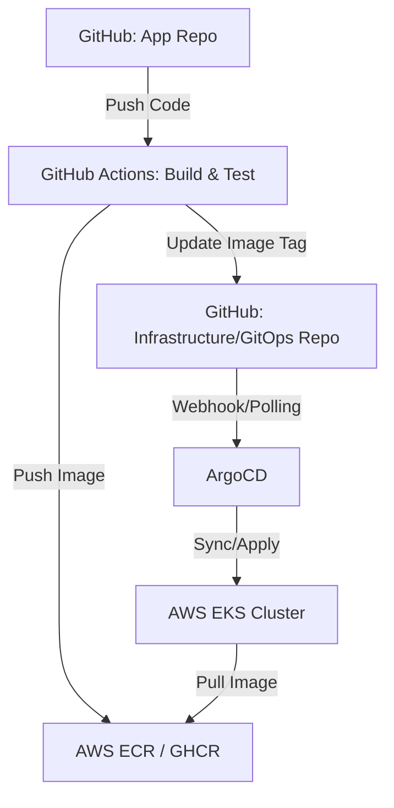
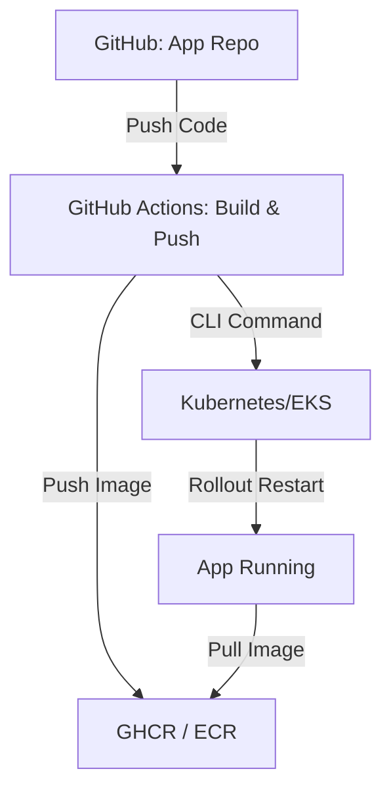

# CI/CD Workflows: AWS & GitHub Integration

Tài liệu này chi tiết hóa hai quy trình triển khai (deployment workflows) phổ biến nhất khi kết hợp **GitHub** với hạ tầng **AWS (EKS/ECS)**, sử dụng mô hình **GitOps** và **Direct Rollout**.

---

## 1. Thành phần chính (Core Components)

| Thành phần | Tên đầy đủ | Vai trò |
| :--- | :--- | :--- |
| **GHCR** | GitHub Container Registry | Lưu trữ Docker Images trực tiếp trên GitHub (thay thế Docker Hub). |
| **ECR** | Amazon Elastic Container Registry | Dịch vụ lưu trữ Docker Images bảo mật trên AWS. |
| **ArgoCD** | GitOps Tool | Công cụ đồng bộ hóa trạng thái giữa Git repository và Kubernetes cluster. |
| **EKS** | Amazon Elastic Kubernetes Service | Dịch vụ Kubernetes được quản lý bởi AWS. |
| **ECS** | Amazon Elastic Container Service | Dịch vụ chạy container (không cần K8s) trên AWS. |
| **GitHub Actions** | CI/CD Service | Nền tảng tự động hóa các quy trình (workflows) trong GitHub. |
| **Runner** | Execution Agent | Các máy ảo hoặc container thực hiện các tác vụ trong workflow. |

---

## 2. GitHub Actions & Runners: "Trái tim" của CI/CD

Trước khi vào chi tiết quy trình, cần hiểu GitHub vận hành tự động hóa như thế nào thông qua hai khái niệm cốt lõi:

### GitHub Actions (Workflows)
Đây là dịch vụ cho phép bạn tự động hóa các quy trình phần mềm. Bạn định nghĩa các bước thực hiện trong các file YAML (đặt tại `.github/workflows/*.yml`).
*   **Ví dụ**: Mỗi khi có code mới (Push), GitHub Actions sẽ tự động chạy các job như: Checkout -> Test -> Build Docker -> Push ECR.

### GitHub Runners (Máy thực thi)
Runner là các máy chủ thực sự chạy các câu lệnh trong file YAML của bạn.

| Loại Runner | Đặc điểm | Ưu & Nhược điểm |
| :--- | :--- | :--- |
| **GitHub-hosted** | Máy ảo cấu hình sẵn do GitHub cung cấp (Ubuntu, Windows, macOS). | ✅ Tiện dụng, không cần cài đặt.   ❌ Tốn phí sau khi hết quota, khó truy cập tài nguyên nội bộ VPC. |
| **Self-hosted** | Máy chủ do bạn tự quản lý (Vd: **EC2 trên AWS** hoặc server vật lý). | ✅ Miễn phí sử dụng, toàn quyền kiểm soát cấu hình, bảo mật cao.   ❌ Phải tự bảo trì và cập nhật phần mềm. |

> [!IMPORTANT]
> **Tại sao nên dùng Self-hosted Runner trên AWS?**
> 1. **Bảo mật**: Runner nằm trong VPC của bạn, có thể đẩy image trực tiếp lên ECR qua **IAM Role** mà không cần để lộ AWS Credentials (Access Key/Secret Key) trên GitHub.
> 2. **Tốc độ**: Push/Pull image lên ECR cực nhanh vì chạy trong mạng nội bộ của AWS.
> 3. **Chi phí**: Tận dụng các máy EC2 Spot sẵn có để giảm chi phí chạy job.

---

## 3. Workflow 1: GitOps với ArgoCD (Khuyên dùng cho EKS)

Đây là quy trình hiện đại, tách biệt giữa "Build Code" và "Deploy Manifest". Mọi thay đổi về hạ tầng đều được lưu vết trong Git.

### Sơ đồ quy trình (Mermaid Diagram)

### Các bước chi tiết:

1.  **Code Push**: Lập trình viên push code lên repository ứng dụng.
2.  **Build & Push**: GitHub Action kích hoạt, build Docker image và gắn tag (thường là Commit SHA hoặc Semantic Version). Sau đó push vào **ECR** (hoặc GHCR).
3.  **Update Manifest**: Trong cùng pipeline, CI sẽ gửi một Pull Request hoặc commit trực tiếp để cập nhật tag image mới vào **Infrastructure Repo** (nơi chứa file YAML của K8s).
4.  **ArgoCD Sync**: ArgoCD theo dõi Infrastructure Repo. Khi thấy có sự thay đổi, nó sẽ tự động so sánh (Diff) và áp dụng (Sync) các thay đổi đó lên cluster.
5.  **EKS Rollout**: Kubernetes thực hiện Rolling Update, kéo image mới từ ECR về và khởi chạy các Pod mới.

---

## 4. Workflow 2: Direct Rollout (Truyền thống/Đơn giản)

Phù hợp cho các dự án nhỏ hoặc khi không muốn quản lý thêm một công cụ GitOps như ArgoCD.

### Sơ đồ quy trình

### Các bước chi tiết:

1.  **Build & Push**: Tương tự Workflow 1, CI build và push image lên registry.
2.  **Update Deployment**: CI sử dụng công cụ CLI như `kubectl` hoặc `aws cli` để cập nhật trực tiếp tài nguyên trên cluster.
    *   Ví dụ: `kubectl set image deployment/myapp myapp=ghcr.io/org/repo:tag`
3.  **K8s Rollout**: Kubernetes nhận lệnh và thực hiện roll out ngay lập tức.

---

## 5. So sánh ECR vs GHCR

| Tính năng | ECR (AWS) | GHCR (GitHub) |
| :--- | :--- | :--- |
| **Tốc độ Pull** | Nhanh hơn (khi chạy trên EKS/ECS cùng vùng). | Nhanh (phụ thuộc đường truyền GitHub-AWS). |
| **Bảo mật** | IAM Role, KMS encryption tích hợp sâu. | GitHub Personal Access Tokens (PAT). |
| **Chi phí** | Tính phí theo dung lượng lưu trữ & data transfer. | Miễn phí cho Public, tính phí theo gói cho Private. |
| **Sự tiện dụng** | Cần cấu hình AWS Credentials trong GitHub. | Tích hợp sẵn với `GITHUB_TOKEN`. |

---

## 6. Khi nào nên dùng cái nào?

*   **Dùng ArgoCD + EKS**: Khi bạn có hệ thống lớn, nhiều môi trường (Dev, Staging, Prod) và cần tính minh bạch cao (biết ai đã thay đổi gì trên cluster thông qua Git history).
*   **Dùng Direct Rollout**: Khi bạn cần tốc độ triển khai nhanh, cấu hình đơn giản và team chưa có kinh nghiệm vận hành GitOps.
*   **Dùng ECR**: Nếu toàn bộ ứng dụng của bạn nằm trên AWS để tối ưu bảo mật và chi phí data transfer nội bộ.
*   **Dùng GHCR**: Nếu bạn muốn quản lý mọi thứ tập trung tại GitHub và ứng dụng có thể chạy trên nhiều nền tảng đám mây khác nhau.
