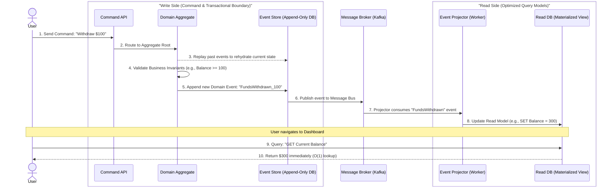

# Event Sourcing and CQRS: Architectural System Design

This document outlines the architectural principles, design patterns, and critical implementation details for a system built upon Event Sourcing (ES) and Command Query Responsibility Segregation (CQRS). It serves as a principal-level guide for designing highly robust, scalable, and auditable systems, particularly in financial or transaction-heavy domains.

---

## 1. Executive Summary: Core Concepts

To conceptualize the architecture, consider the management of a financial ledger or a digital wallet.

### Traditional State-Based Storage (CRUD)
In traditional systems, the database stores the current state:
`{ ID: "Wallet_User_A", Balance: 500 }`
*   **Action:** Spending $100 triggers an `UPDATE` command, overwriting the balance to $400.
*   **Crucial Flaw:** The historical context is permanently lost (destructive mutation). If an audit requires knowing *why* the balance is $400, the system cannot natively answer without relying on auxiliary, often desynchronized, audit logs.

### Event Sourcing (ES)
Instead of storing the current state, an Event-Sourced system stores an append-only, immutable log of domain events:
1. `{"event": "FundsDeposited", "amount": 500, "timestamp": "T1"}`
2. `{"event": "FundsWithdrawn", "amount": 100, "timestamp": "T2"}`

*   **State Reconstruction:** The current state (Balance: $400) is derived by "replaying" or aggregating the event stream from inception.
*   **Strategic Advantage:** Absolute data fidelity. The system retains a flawless, unalterable history of every state transition, which is critical for accounting, auditing, and complex debugging.

### The Problem of Read Scalability & The CQRS Solution
*   **The Computational Cost of ES:** Replaying thousands of events sequentially just to fetch a current balance on a mobile app is computationally prohibitive and causes severe latency.
*   **Command Query Responsibility Segregation (CQRS):** To mitigate read penalties, we strictly separate the **Write (Command)** workload from the **Read (Query)** workload.
    *   **Command Side (Write):** Responsible for executing business logic, validating invariants, and appending events to the Event Store. It does not handle complex data fetching.
    *   **Query Side (Read / View Model):** Maintains pre-calculated, materialized views (Read Models) optimized specifically for UI presentation.
    *   **Synchronization:** When the Command side persists an event, it publishes an asynchronous notification (e.g., via Kafka). The Query side's projector listens to this event and updates its optimized Read DB (e.g., updating the stored balance from 500 to 400). Reads are served from this projection with sub-millisecond latency.

---

## 2. High-Level Architecture Flow



---

## 3. Principal-Level Engineering Challenges & Mitigation Strategies

While the architecture provides immense benefits, it introduces inherent distributed systems complexities. The following patterns address critical production scenarios:

### 3.1. Concurrent State Mutations (Race Conditions)
**Scenario:** Two simultaneous transactions attempt to withdraw $100 from an account that only has $100. Both read the same initial state before appending their events, potentially leading to an overdraft by allowing both events to persist.
**Mitigation:** **Optimistic Concurrency Control (OCC) via Stream Versioning.**
*   Every event stream has an explicit version incremented upon every write.
*   When a command targets an aggregate, it notes the current version (e.g., `v2`).
*   Upon appending the new event to the Event Store, the Command layer explicitly requires the database stream to still be at `v2`.
*   If another transaction has already advanced the stream to `v3`, the database rejects the write (`ConcurrencyException`). The command is then either failed back to the user or cleanly retried.

### 3.2. Schema Evolution & Event Versioning
**Scenario:** In 2024, a `Transaction` event was saved as JSON v1 with a `fee` property. In 2025, business requirements dictate that we use `transaction_fee` and require a new `vat_fee` property.
**Core ES Rule:** **Historic events in the Event Store are strictly immutable.** Applying a SQL `UPDATE` to modify historical JSON payloads destroys the integrity of the audit log.
**Mitigation:** **The Upcaster Pattern (In-Memory Transformation).**
*   Events retrieved from the Event Store must pass through a serialization pipeline before reaching the Domain Logic.
*   An 'Upcaster' intercepts older payload versions (v1) and transforms them in memory into the latest schema (v2) by mapping old fields and supplying defaults for missing data.

**Example implementation approach:**
```python
# 1. Stored Immutable Payload (from DB):
raw_json_db = '{"event_type": "Transaction_V1", "fee": 500}'

# 2. Pipeline Transform (Upcaster):
def upcaster_pipeline(raw_json):
    data = json.loads(raw_json)
    
    if data["event_type"] == "Transaction_V1":
        # Mutate structure IN MEMORY ONLY
        data["transaction_fee"] = data.pop("fee")
        data["vat_fee"] = 0 # Default for legacy events
        data["event_type"] = "Transaction_V2" 

    return data 

# 3. Domain Logic Execution:
# The aggregate only ever works with the V2 schema, regardless of the DB state.
event_v2_ready = upcaster_pipeline(raw_json_db)
```

### 3.3. Long Stream Rehydration Latency
**Scenario:** An active entity accrues tens of thousands of events over its lifetime. Loading and replaying this massive history on every single command execution drastically degrades performance and spikes CPU usage.
**Mitigation:** **Snapshotting (State Checkpoints).**
*   Generate a serialized projection of the aggregate's state after every $N$ events (e.g., every 100 events).
*   For subsequent commands, the system loads the most recent Snapshot and only replays the sparse events occurring *after* that Snapshot.
*   Crucially, Snapshots are ephemeral optimizations. If snapshots are lost, they can be entirely rebuilt from the immutable Event Store, guaranteeing no permanent data loss.

### 3.4. The "Read-Your-Writes" Dilemma (Eventual Consistency UX)
**Scenario:** A user submits a form to create a new resource. The Command API returns a `202 Accepted` success code. However, the UI immediately polls the Read API, which returns a `404 Not Found` because the background Projector hasn't finished synchronizing the Event into the Read DB.
**Mitigation Strategies:**
1.  **Optimistic UI Updates:** The Frontend assumes success and injects the new data locally into its state cache. It displays the fake data immediately and reconciles later when polling succeeds.
2.  **WebSocket/Server-Sent Events (SSE):** The Frontend displays a loading indicator while listening on a WebSocket. The Read Projector, upon successfully updating the querying database, broadcasts a confirmation event to the socket, prompting the UI to refresh.
3.  **Polling with Backoff:** Simple but effective mechanism where the client retries the Read API for a few seconds until the projection lands.

---

> [!CAUTION]
> ### Architectural Decision Matrix
> Implementing ES/CQRS involves significant infrastructural overhead and cognitive load.
> **DO NOT USE** for simple CRUD APIs, content management systems, or standard web applications where data immutability is not a strict requirement.
> **USE IMMEDIATELY** for core financial ledgers (e.g., Payment Gateways, Cryptocurrency exchanges), complex collaborative workflows, or highly regulated environments requiring flawless, temporal auditing and forensic capabilities.
