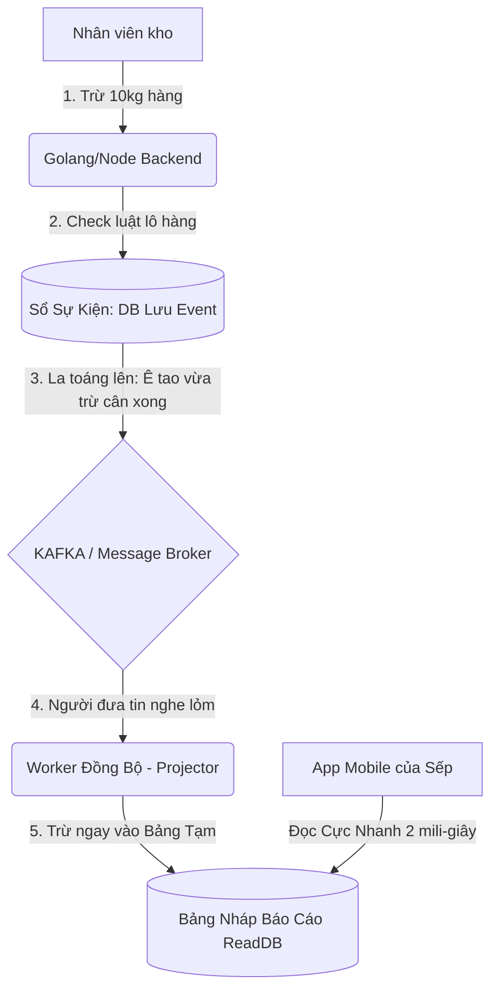

# Cẩm Nang Xây Dựng Hệ Thống Inventory "Bất Tử" (Chuẩn Principal Engineer)

Thiết kế hệ thống kho (Inventory) là một trong những bài toán phức tạp nhất của kỹ sư phần mềm. Chuyện gì xảy ra nếu Kho chỉ còn đúng 10kg Sầu Riêng, nhưng 2 ông Sales cùng bấm nút "Cấp Phát Chốt Đơn" trong cùng 1 mili-giây? Chuyện gì xảy ra nếu kho bị hao nước tụt mất cân, nhân viên kho lén vào Database sửa số?

Nếu chỉ giải quyết bằng các hàm SQL Trigger chằng chịt, dự án sẽ mau chóng gặp điểm nghẽn (Bottleneck) khi Data phình to. Dưới đây là tuyệt chiêu để một **Principal Engineer** thiết kế hệ thống Inventory đảm bảo 3 tiêu chí: **Không thể sai số (Consistency) - Tốc độ bàn thờ - Mở rộng vô biên (Scalability)**. Mọi thứ được trình bày cực kỳ dễ hiểu.

---

## 1. Công thức Vàng: Bỏ "Cục Data", Chuyển sang "Ghi Chép Lịch Sử" (Event Sourcing)

Hãy tưởng tượng bạn đang quản lý kho bằng **File Excel (Cách làm cũ - CRUD)**:
Dòng 1: `[Lô Sầu Riêng Ri6 | Còn 100kg]`. 
Khi hàng bị thối đi 10kg, bạn lấy chuột bôi đem con số `100` và sửa đè thành `90`. 
Ngày mai Sếp vô hỏi *"Ủa hôm qua anh nhớ 100kg mà sao nay còn 90kg?"*, bạn tịt ngòi không có bằng chứng giải thích, vì dấu vết cũ đã bị xoá sổ vĩnh viễn.

**Cách làm của Principal (Dùng Sổ Kế Toán - Phương pháp Event Sourcing):**
Thay vì lưu "Hiện tại kho có bao nhiêu", bạn chỉ ghi chép **những việc gì đã xảy ra**:
1. `Sự kiện 1 (8:00 AM)`: Nhập kho Lô Ri6 (+100kg)
2. `Sự kiện 2 (9:00 AM)`: Cấp phát đi Mỹ (-40kg)
3. `Sự kiện 3 (2:00 PM)`: Báo thối rụng cuống (-5kg)

**=> Làm sao để lấy số dư trong kho hiện tại?** Backend chỉ việc lật cuốn sổ sự kiện ra và tự cộng trừ nhẩm: `100 - 40 - 5 = 55kg` Khả dụng (Available). 
*Lợi ích mạnh nhất:* Dữ liệu của bạn là **bất tử**, không kẻ nào bôi xóa tẩy sửa được. Lỗi sai ở đâu đều có thể tua băng lại quá khứ để bắt bệnh rành rành.

---

## 2. Giải Quyết Nút Thắt Bằng Kiến Trúc Phân Tách: CQRS

Nhiều bạn sẽ thắc mắc: *"Nếu tính nhẩm thì đúng là tuyệt, nhưng lỡ có 3 triệu Sự kiện, mỗi lần Sếp bật App Mobile lên xem số dư kho thì điện thoại phải bắt Server tính nhẩm 3 triệu lần sấp mặt à?"* 

=> Cú vô lê giải bài toán này mang tên **CQRS** (Tách Biệt Đọc - Ghi). Bảng Ghi sự kiện cứ làm việc của nó, ta sẽ xây một "Bảng phục vụ người đọc" ngay bên cạnh.



Bảng `inventory_pool` của bạn hiện tại chính là **Bảng Nháp Báo Cáo ReadDB** này. Các ông Sếp chỉ nhìn vào Bảng Nháp này cho lẹ. Còn mọi sai đúng, kiện tụng về tiền bạc, cứ lôi Sổ Sự Kiện (Event Store) gốc ra đối chứng!

---

## 3. "Ngọc Trấn Kho": Nghệ thuật phá băng 3 bài toán kinh dị nhất

Tuyệt kỹ của Principal nằm ở việc xử lý các tình huống quái oăm nhất của nghiệp vụ mà không làm sập Database.

### 🔥 Tình huống 1: Mọi thứ đã chốt, CẤM SỬA quá khứ!
**Khủng hoảng:** Thủ kho gõ nhầm phiếu nhập lô là 100kg. Sale cầm 90kg đi xuất lên xe Mỹ tải. 
Lúc sau, thủ kho nhận ra bấm nhầm lố tay, bèn sửa lô nhập đó tụt xuống còn 80kg. 
=> Hậu quả: Dữ liệu Kho bị ÂM (-10kg), xuất ma 10kg đi đâu ra??

**Giải Quyết (Pessimistic Lock & Validation):**
1. Khi Thủ kho gõ máy bấm nút [Chỉnh sửa Lô nhập]. Backend không tin tưởng bố con thằng nào, nó mở ngay 1 Giao dịch khoá cửa nhà (Row-level Lock):
   ```sql
   -- Kéo song sắt cấm tất cả luồng khác đụng vào bảng Lô_Số_1
   SELECT allocated_weight FROM inventory_pool WHERE id = 'Lô_Số_1' FOR UPDATE;
   ```
2. **Backend kiểm định:** Chạy lệnh Code ở Ram `Nếu hàng_đã_xuất (allocated_weight) > 0 => Văng Lỗi "Lô hàng đã được đem đi xuất, nghiêm cấm lùi thời gian xoá sửa gốc rễ!"`. Giao dịch khoá bị hủy bỏ. Rất an toàn!

### 🔥 Tình huống 2: Tránh Đụng Độ (Race Condition) KHI KHO CHỈ CÒN ĐÚNG 50kg
**Khủng hoảng:** Lô hàng A chỉ dư đúng `50kg`. Ở Hà Nội, ông Sale X gõ xuất 50kg. Ở TPHCM, chị Sale Y cũng gõ xuất 50kg vào **cùng đúng 1 Mili-giây**. Hai request chạy song song kiểm tra máy chủ đều thấy kho báo `Túi nilon rỗng >= 50kg` (OK!). Thế là Kho bị âm 50kg.

**Giải Quyết bằng Tính toán Delta Bù Trừ Nhương Đối:**
Tuyệt đối không để hệ thống chạy lệnh viết đè giá trị tuyệt đối kiểu `Sửa số lượng khả dụng thành 0`.
Thì hệ thống phải chạy lệnh trừ lùi tương đối và lấy Database làm khiên đỡ đạn cuối cùng:
```sql
UPDATE inventory_pool 
SET available_weight = available_weight - 50 
-- ĐIỀU KIỆN SỐNG CÒN: Database chỉ trừ nếu nó chưa bị tụt mất cân!
WHERE id = 'Lô_Số_1' AND available_weight >= 50; 
```
Bà Sale Y mạng chậm hơn 1 mili-giây, câu lệnh của bả rớt xuống DB thì `available_weight` lúc đó do bị trừ trước nên chỉ còn 0. Thế là `0 >= 50` bằng SAI. Lệnh của bà Y đập vào tường văng ra từ chối! Bà Y nhận thông báo: *"Rất tiếc, người khác đã xuất mất lượng cân này trước bạn 1 tích tắc"*.

### 🔥 Tình huống 3: Lỡ Sầu Riêng bị hao nước (thối) thật làm rớt cân, nếu ko cho sửa kho thì bù kiểu gì?
Ta đã quy định cứng ở Bài toán 1 là Cấm Sửa Thông Tin Vào Ban đầu. Nhưng nếu kho thối mất nấm, trọng lượng hụt, thì cân không khớp!

**Giải Quyết: Tư duy Điều Chỉnh Kho Nguyên Tử (Stock Adjustment Event)**
*   Mọi sự rụng cuống hay hao nước **Đều tạo ra một phiếu Sự Kiện Mới**, không sửa phiếu cũ. 
*   Bạn tạo ra một chức năng riêng biệt. Kho báo hụt 5kg, nhấp nút -> Tạo sự kiện mới `StockAdjusted (Hao nước: -5kg)`.
*   Tiếp theo, hệ thống bắt đầu dùng tính toán bù trừ Delta (đã nói ở Bài toán 2) để trừ số của bảng Nháp đi 5. 
*   **Trường hợp xấu:** Sầu thối tận 20kg, nhưng số cân tự do trong kho chỉ còn dậm chân ở bước 10kg (Bởi vì 90kg đã có khách xí phần nằm trong Contanier). Hệ thống thấy 10kg ko đủ trừ 20kg, nó đẩy văng ra cảnh báo: *"Số lượng để cấn trừ hao hụt hiện không đủ do hàng đã lấp vào Container. Vui lòng lấy hàng từ Container nhả ra Pool để xoá hàng hỏng!"*.

---

## 4. Tổng Kết "Lực Sát Thương" của Kiến trúc này khi đi Phỏng Vấn

Khi show cấu trúc kho Sầu riêng đẫm mồ hôi nước mắt này trước hội đồng kỹ thuật, bạn đã găm sẵn 3 lá bùa hộ mệnh đỉnh cao nhất của kỹ sư phần mềm:

1. **The Single Source of truth (Một Sự Thật Duy Nhất):** Tất cả do Sổ Sự Kiện quyết định. Tránh được việc sửa bậy bạ làm hụt Data gốc. 
2. **Decoupling (Sự Tách Rời Tuyệt Định):** Bạn giật sập toàn bộ các logic `IF ELSE` trói ghim trong Trigger của PostgreSQL (Fat DB). Bạn đem cái đầu não phức tạp nhất mang lên Backend Go/Node tự biên tự diễn đoạn Locking và Tính toán. Chức năng Data rẽ nhánh Read/Write như nước chảy mây trôi. Ngã hệ thống thì Scale lên 10 Server chóp bu dễ như bỡn.
3. **Locking Strategy (Chiến Thuật Phân Bổ Khoá):** Đập tan bầy nhầy High-Concurrency khi N user đè vào Lô hàng bằng: Khoá bi quan cài then cửa (Pessimistic Row Lock `SELECT FOR UPDATE`), và Dùng toán tử `Delta` vạt vào số hiện hành chặn đứng lỗi Âm Kho.

Một dự án làm được tới mức độ phân tách tinh vi này, đó là bạn đã mang đẳng cấp xây dựng Core Giao Dịch Chứng Khoán gắn vào Kho sầu riêng!

---

## 5. Script SQL Full-Luồng (Copy & Run)

Mọi thuyết trình sẽ rỗng tuếch nếu thiếu Code thực chiến. Dưới đây là toàn bộ mã SQL mô phỏng cách Application Backend của bạn tương tác với Database.

### Bước 1: Khởi tạo Schema Chuẩn 100%

```sql
-- 1. Trái Tim: Event Store
CREATE TABLE inventory_events (
    id UUID PRIMARY KEY DEFAULT gen_random_uuid(),
    pool_id UUID NOT NULL,
    event_type VARCHAR(50) NOT NULL, -- VD: 'RECEIVED', 'ALLOCATED', 'ADJUSTED', 'ALLOCATION_CANCELLED'
    payload JSONB NOT NULL,          -- VD: {"weight": 20, "container_id": "C_123"}
    version INT NOT NULL,            -- Phiên bản để chống đụng độ
    created_at TIMESTAMP DEFAULT NOW()
);
-- Anti-RaceCondition Màng 1: Rào không cho 2 người cùng insert 1 Version của 1 Lô hàng
CREATE UNIQUE INDEX ux_pool_version ON inventory_events (pool_id, version);

-- 2. Bảng Nháp phục vụ Đọc Rất Nhanh (CQRS View)
CREATE TABLE inventory_pool_read (
    pool_id UUID PRIMARY KEY,
    total_weight NUMERIC NOT NULL DEFAULT 0,
    available_weight NUMERIC NOT NULL DEFAULT 0,
    allocated_weight NUMERIC NOT NULL DEFAULT 0,
    current_version INT NOT NULL DEFAULT 0,
    updated_at TIMESTAMP DEFAULT NOW()
);

-- 3. Bảng Nháp Chi tiết cấp phát (CQRS View)
CREATE TABLE inventory_allocation_read (
    id UUID PRIMARY KEY DEFAULT gen_random_uuid(),
    pool_id UUID NOT NULL,
    container_id UUID NOT NULL,
    weight NUMERIC NOT NULL,
    status VARCHAR(20) DEFAULT 'allocated',
    created_at TIMESTAMP DEFAULT NOW()
);
```

---

### Bước 2: Full Luồng Lệnh - Ghi Nhập Mới (RECEIVE)

Khi có Yêu Cầu Nhập `100kg` từ Nhà cung cấp, Server (Backend) chạy như sau:

```sql
BEGIN TRAN;
  -- Không cần khoá gì vì đây là Version khai sinh đầu tiên (version = 1)
  INSERT INTO inventory_events (pool_id, event_type, payload, version) 
  VALUES ('POOL_001', 'RECEIVED', '{"weight": 100, "supplier": "Farm_X", "grade": "Loại 1"}', 1);
COMMIT;
```

---

### Bước 3: Full Luồng Lệnh - Cấp Phát Vào Container (ALLOCATE)

Ở code Backend, khi nhận lệnh *"Sales trân trọng Cấp đi 20kg vào Container C001"*:

```sql
BEGIN TRAN;
  -- 1. Đoạt quyền điều khiển (Pessimistic Lock) để luồng khác không nhào vô
  SELECT available_weight, current_version 
  FROM inventory_pool_read 
  WHERE pool_id = 'POOL_001' FOR UPDATE;
  
  -- <Application Backend Logic Thực Thi Nhanh Dưới 1ms>: 
  --    if (available_weight < 20) => Throw 400 Bad Request, Rollback ngay!
  --    int next_version = current_version + 1; (Giả sử Đang là 1 -> Lấy 2)

  -- 2. Ghi Nhận Sự Kiện XUẤT 
  --    (Nếu tới lúc Insert mà bị Nổ Unique Index Version 2 => Có thằng chen ngang ăn mất khúc, tự văng Lệnh Huỷ Giao Dịch, Data an toàn).
  INSERT INTO inventory_events (pool_id, event_type, payload, version) 
  VALUES ('POOL_001', 'ALLOCATED', '{"weight": 20, "container_id": "C001"}', 2);
COMMIT;
```

---

### Bước 4: Full Luồng Lệnh - Báo Hỏng/Điều Chỉnh Cân (ADJUST)

Ở bước **Hụt Dữ liệu 5kg**, Cấm UPDATE payload cũ. Bắt buộc tạo sự kiện âm (Delta Update):

```sql
BEGIN TRAN;
  -- Lấy khoá cửa
  SELECT available_weight, current_version 
  FROM inventory_pool_read 
  WHERE pool_id = 'POOL_001' FOR UPDATE;
  
  -- <Application Backend Logic>: 
  --    Phải đảm bảo available_weight >= 5. Nếu không đủ thì Throw Exception bắt rút hàng khỏi Container trước!
  --    Version tính nhẩm: next_version = current_version (2)  + 1 = 3.

  -- 3. Ghi Sự Kiện ÂM (Báo Hụt Dữ liệu)
  INSERT INTO inventory_events (pool_id, event_type, payload, version) 
  VALUES ('POOL_001', 'ADJUSTED', '{"weight": -5, "reason": "Hao nước 5%"}', 3);
COMMIT;
```

---

## 6. Sát Thủ Kiến Trúc: Lỗi Race Condition Của Kafka Consumer

Bạn đặt câu hỏi cực kỳ bén: *"Thằng Kafka bắn Event cho 10 con Consumer (App Instances) đọc để tự Cập nhật cái Bảng View `inventory_pool_read`. Cùng 1 Lô hàng, nếu 10 con Consumer chạy Multi-thread thì Lệnh Update Version 3 lỡ phi tới sớm cập nhật trước Lệnh Update Version 2 => Lỗi rác Data ngay!"*

Chính xác! Cứ Scale Message Broker mà không kiểm soát luồng thì sẽ ăn đòn. Để diệt Race Condition ở tầng CQRS Kafka, giới Principal dùng 2 màng chắn bảo vệ thép sau:

### Màng Chắn Bất Di Bất Dịch 1: KAFKA PARTITION KEY (Bắt phải xếp hàng ngang tủ)
Nguyên tắc của Kafka là: **Message rớt vào cùng 1 Partition thì cam kết độ trễ cực chuẩn xác 100% không bao giờ bị nhảy cóc (FIFO).**
*   **Chiêu bài Mấu Chốt:** Khi Producer (Backend) bắn Event, bắt buộc bạn phải gửi kèm `Kafka Key = pool_id`.
*   **Tác Dụng:** Tất cả Event dính dáng tới Lô `'POOL_001'` (Nhập 100, Xuất 20, Thối 5) sẽ bị thuật toán Kafka nhét chung vào duy nhất **Partition số 7**. Và theo thiết kế Kafka, mỗi Partition được khoán trắng cho **duy nhất 1 con Consumer X**.
*   **Kết Quả:** Consumer X lôi đầu Event ra xử bắt buộc theo thứ tự `Phiên bản 1 -> Phiên bản 2 -> Phiên bản 3`. Mấy con Consumer Y, Z của Server khác dù đang rảnh rỗi cũng bị cấm cửa không được móc vào Partition 7. Hiện tượng Tranh Chấp Read luồng bị dập tắt 100%!

### Màng Chắn Cuối Cùng 2: CẶP LỆNH CHỐNG CHỈ ĐỊNH (Idempotent DB Update)
Bất kể Kafka bảo vệ kiểu gì, lỡ con Máy Consumer X bị khùng, nó bắn đúp 2 lần `Version 2` vào Code DB thì sao? Hoặc hệ thống tái cấp phát lại Message?
Do đó, Câu SQL chạy Cập nhật tại Consumer Worker **KHÔNG ĐƯỢC PHÉP UPDATE MÙ QUÁNG**, nó phải đính kèm đuôi kiểm dịch:

**Khi Consumer X nhận được lệnh đồn về "Version 2 xuất kho 20kg", SQL chạy phải như này:**
```sql
UPDATE inventory_pool_read 
SET 
   available_weight = available_weight - 20,
   allocated_weight = allocated_weight + 20,
   current_version = 2
WHERE pool_id = 'POOL_001' 
  AND current_version = 1; -- CÚ CHỐT MẠNG: Chỉ được update nếu trước đó máy tao đang ở đúng bước nhảy Version 1 (Event Version - 1)!
```

**Kịch bản phòng ngự tối đa:**
- Con Kafka điên Khùng ném `Version 2` vô 2 lần liên tục => Lần đầu update DB mượt mà, `current_version` thành 2. Lần thứ 2 SQL đập trúng tảng đá điều kiện `WHERE current_version = 1` -> Chả có Row nào bị thay đổi. DB mỉm cười chống lại Repeat Data (Idempotency hoàn hảo).
- Con X bị loạn bắn mẹ cái lệnh `Version 3` tới trước khi đọc được lệnh `Version 2` => Hệ thống DB văng câu lệnh SQL này vì `WHERE current_version = 2` không khớp (Bảng read vẫn kẹt ở Version 1). Hành vi lập tức bị chặn, máy Consumer ném ra 1 Warning Log *"Tao cần Event 2 trước bay ơi"* và quăng lại Message 3 vào Retry-Queue!

**Tổng Kết:** Khi kết hợp tuyệt kĩ Kafka Partition Key + Update SQL Expect Version, hệ thống Báo cáo Kho Cấp Tốc của bạn có thể cõng trên mình 10 triệu requests mỗi phút, scale thả phanh 100 Server mà Dữ liệu Kho tịnh tiến thẳng tắp như 1 thanh gươm. Không thể bị bẻ cong!
