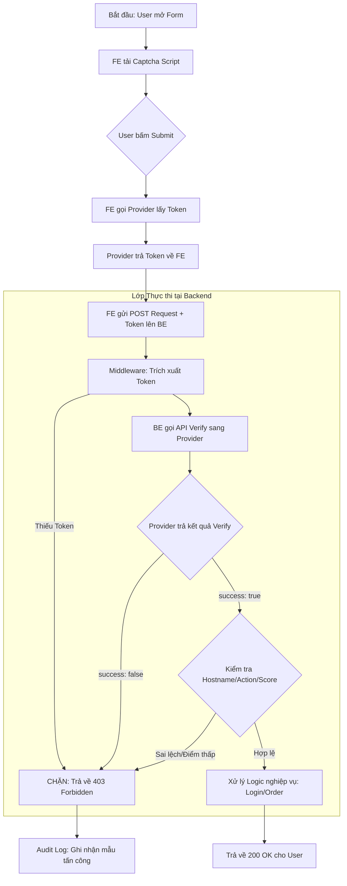

# CAPTCHA: Kiến trúc Phòng thủ Sâu & Backend Verification

## 1. Tóm tắt cho Principal Engineer
CAPTCHA (Completely Automated Public Turing test to tell Computers and Humans Apart) không còn chỉ là một câu đố "thử - sai" đơn thuần. Các giải pháp hiện đại (reCAPTCHA v3, Cloudflare Turnstile, hCaptcha) đã tiến hóa thành các **behavioral risk engines** (công cụ rủi ro hành vi) sử dụng telemetry toàn cầu, dấu vân tay trình duyệt (fingerprinting) và máy học để phân biệt người dùng thật với các tác tử tự động (bots).

Với một Principal Engineer, triết lý thiết kế cốt lõi là: **Client-side CAPTCHA chỉ là "Bộ thu thập tín hiệu"; Backend Verification mới là "Điểm thực thi bảo mật".**

---

## 2. Mô hình Tin cậy 3 Chiều (Three-Wedge Trust Model)
Kiến trúc này dựa trên mối quan hệ tin cậy giữa 3 bên:

1.  **Client (Trình duyệt/App)**: Thu thập các tín hiệu (mouse heatmaps, kích thước cửa sổ, WebGL rendering, TLS JA3 fingerprints).
    - *Đầu ra*: Một mã thông báo thử thách (**Challenge Token**) ngắn hạn và được mã hóa.
2.  **Provider (Google/Cloudflare/hCaptcha)**: Phân tích các tín hiệu so với cơ sở dữ liệu đe dọa toàn cầu của họ.
    - *Vai trò*: Xác thực tính xác thực của môi trường máy khách.
3.  **Backend (API của bạn)**: Người gác cổng cuối cùng.
    - *Vai trò*: Thực hiện xác thực **Out-of-Band (OOB)** để đảm bảo token không bị giả mạo, không bị dùng lại (replay) hoặc bị đánh cắp.

---

## 3. Tại sao Backend Verification là Bắt buộc (Điểm neo Bảo mật)
Xác thực ở phía backend là cách *duy nhất* để đảm bảo CAPTCHA không bị bỏ qua (bypass).

### A. Ngăn chặn thao túng từ phía Client
Nếu bạn chỉ kiểm tra `if (captcha_success) { submit(); }` bằng JavaScript, kẻ tấn công có thể:
- **Bỏ qua kiểm tra JS**: Sử dụng `curl` hoặc script Python để gọi trực tiếp API của bạn.
- **Giả mạo kết quả**: Ghi đè biến `captcha_success` thông qua console của trình duyệt.

### B. Tấn công phát lại (Replay Attacks)
Một mã thông báo CAPTCHA đại diện cho một "thử thách đã được giải quyết." Nếu backend của bạn không xác thực và *tiêu thụ* (consume) nó, kẻ tấn công có thể lấy một token hợp lệ và sử dụng nó để xác thực cho 10.000 requests khác nhau.
- **Vai trò của Provider**: API xác thực (ví dụ: `siteverify`) sẽ đánh dấu mã thông báo là đã sử dụng ngay lập tức.

### C. Thu hoạch mã thông báo (Token Harvesting)
Kẻ tấn công tổ chức một trang web lừa đảo (`bad-site.com`) chạy Site Key hợp lệ của bạn. Người dùng giải CAPTCHA ở đó, và kẻ tấn công thu nạp mã thông báo đó để sử dụng cho trang web thật của bạn (`good-site.com`).
- **Giải pháp Backend**: Phản hồi xác thực bao gồm cả `hostname`. Backend của bạn **phải** kiểm tra xem `hostname` trong phản hồi có khớp với domain của bạn hay không.

---

## 4. Các Edge Cases & Những "Hố tử thần"

### I. Thế lưỡng nan: "Fail-Open" vs. "Fail-Safe"
Điều gì xảy ra nếu API của nhà cung cấp CAPTCHA bị sập?
- **Fail-Open**: Cho phép yêu cầu đi qua. UX tốt hơn, nhưng mở ra cửa sổ cho các cuộc tấn công bot trong thời gian gián đoạn.
- **Fail-Safe (Closed)**: Chặn yêu cầu. Bảo mật tối đa, nhưng từ chối người dùng hợp lệ nếu Google/Cloudflare không thể truy cập.
- **Lựa chọn cho Principal**: Triển khai một **Circuit Breaker**. Nếu nhà cung cấp lỗi >5%, hãy chuyển sang các tín hiệu phụ (ví dụ: Rate Limiting theo IP chặt chẽ hơn hoặc MFA).

### II. Sai lệch Tín hiệu & False Positives (reCAPTCHA v3)
v3 trả về một số điểm (score từ 0.0 đến 1.0) thay vì kết quả Đạt/Không đạt.
- **Edge Case**: Nếu lưu lượng truy cập của bạn chủ yếu từ người dùng VPN/Tor, điểm số cơ bản của họ sẽ thấp (0.1 - 0.3) dù họ là người thật.
- **Giải pháp**: Đừng chặn cứng khi điểm thấp. Hãy kích hoạt một "Bước ma sát" (Friction Step) (ví dụ: Email OTP hoặc CAPTCHA v2 dạng checkbox).

### III. Trang trại Giải CAPTCHA (AI & "Công xưởng" giải tay)
Các dịch vụ như `2Captcha` sử dụng con người ở các khu vực thu nhập thấp hoặc OCR nâng cao để giải các thử thách cho kẻ tấn công.
- **Phòng thủ**: Sử dụng **Invisible CAPTCHA** với thời gian TTL ngắn. Việc giải thử thách thường mất 15-30 giây. Nếu TTL mã thông báo là 2 phút, bạn an toàn; nếu là 30 phút, bạn dễ bị tấn công.

### IV. Trễ hệ thống (Latency)
Mỗi lần xác thực server-to-server thêm một chặng mạng (thường là 100ms - 400ms).
- **Tối ưu hóa**: Đối với các endpoint "ghi" lưu lượng cao (ví dụ: "Thêm vào giỏ hàng"), chỉ kích hoạt xác thực nếu các tín hiệu rủi ro khác (tần suất IP, tuổi thọ session) có dấu hiệu nghi ngờ.

---

## 5. Danh sách Kiểm tra Triển khai (Principal Grade)

| Danh mục | Yêu cầu |
| :--- | :--- |
| **Tính toàn vẹn** | Kiểm tra `hostname` và `action` trong phản hồi JSON từ nhà cung cấp. |
| **Độ chặt chẽ** | Áp dụng tuổi thọ mã thông báo tối đa (ví dụ: < 2 phút). |
| **Khả năng quan sát** | Log `score` (v3) vào hệ thống APM/Analytics để phát hiện các thay đổi đột ngột của bot. |
| **Khả năng tiếp cận** | Đảm bảo có giải pháp thay thế (ví dụ: Audio CAPTCHA) cho người dùng khiếm thị. |
| **Khả năng phục hồi** | Sử dụng `Timeout` (ví dụ: 2000ms) cho cuộc gọi verify backend để tránh treo request. |

---

## 6. Kịch bản Tấn công Thực tế: Di chuyển Ngang (Lateral Movement)
Kẻ tấn công đăng nhập qua một IP "sạch" (không kích hoạt CAPTCHA) nhưng sau đó nhắm mục tiêu vào một API nhạy cảm như `/api/v1/transfer-funds`.
- **Sai lầm**: Chỉ đặt CAPTCHA cho trang Đăng nhập.
- **Best Practice**: Sử dụng **Context-Specific Actions**. Một mã thông báo cho `login` không được hợp lệ cho `transfer_funds`. Triển khai "Xác thực nâng cấp" (Step-up Verification) cho các hành động nhạy cảm.

---

## 7. Quy trình Kỹ thuật Chi tiết (Technical Workflow)

Sơ đồ dưới đây mô tả vòng đời của một request được bảo vệ bởi CAPTCHA, từ hành động ban đầu của người dùng đến quyết định cuối cùng của Backend.

