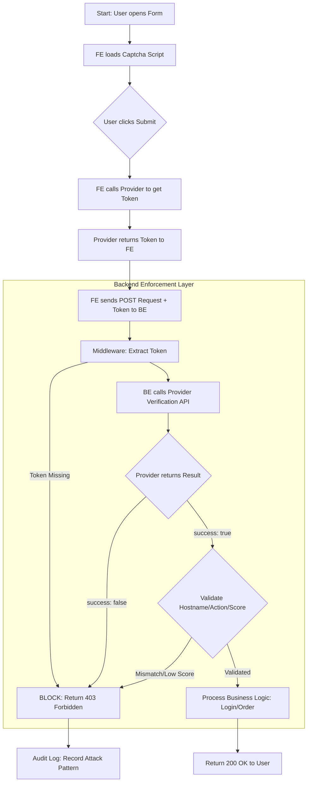

# CAPTCHA: Architecting Deep Protection & Backend Verification

## 1. Executive Summary for Principals
CAPTCHA (Completely Automated Public Turing test to tell Computers and Humans Apart) is no longer just a "challenge-response" puzzle. Modern solutions (reCAPTCHA v3, Cloudflare Turnstile, hCaptcha) have evolved into **behavioral risk engines** that use global telemetry, browser fingerprinting, and machine learning to distinguish between legitimate users and automated agents.

For a Principal Engineer, the core design philosophy is: **Client-side CAPTCHA is a "Signal Collector"; Backend Verification is the "Enforcement Point".**

---

## 2. The Three-Wedge Trust Model
The architecture relies on a triangular trust relationship:

1.  **Client (Browser/App)**: Collects signals (mouse heatmaps, window sizes, WebGL rendering, TLS JA3 fingerprints).
    - *Output*: A short-lived, encrypted **Challenge Token**.
2.  **Provider (Google/Cloudflare/hCaptcha)**: Analyzes signals against their global threat database.
    - *Role*: Validates the authenticity of the client's environment.
3.  **Backend (Your API)**: The final gatekeeper.
    - *Role*: Performs an **Out-of-Band (OOB)** verification to ensure the token hasn't been tampered with, replayed, or stolen.

---

## 3. Why Backend Verification is Mandatory (The Security Anchor)
Verification at the backend is the *only* way to ensure the CAPTCHA hasn't been bypassed.

### A. Preventing Client-Side Manipulation
If you only check `if (captcha_success) { submit(); }` in JavaScript, an attacker can:
- **Skip the JS check**: Use `curl` or a Python script to hit your API directly.
- **Mock the result**: Override the `captcha_success` variable via the browser console.

### B. Replay Attacks
A CAPTCHA token represents a "solved challenge." If your backend doesn't verify and *consume* it, an attacker could capture one valid token and use it to authenticate 10,000 requests.
- **Provider Role**: The verification API (e.g., `https://www.google.com/recaptcha/api/siteverify`) marks the token as used (consumed) immediately.

### C. Token Harvesting (Cross-Domain Attack)
Attacker hosts a phishing site (`bad-site.com`) running your legitimate reCAPTCHA Site Key. A user solves it there, and the attacker captures the token to use against your real site (`good-site.com`).
- **Backend Fix**: The verification response includes the `hostname`. Your backend **must** validate that the `hostname` in the response matches your domain.

---

## 4. Advanced Edge Cases & Pitfalls

### I. The "Fail-Open" vs. "Fail-Closed" Dilemma
What happens if the CAPTCHA provider's API is down?
- **Fail-Open**: Allow the request. Better UX, but opens a window for bot attacks during outages.
- **Fail-Safe (Closed)**: Block the request. Maximum security, but denies legitimate users if Google/Cloudflare is unreachable.
- **Principal Choice**: Implement a **Circuit Breaker**. If the provider fails >5% of the time, fall back to secondary signals (e.g., stricter IP Rate Limiting or MFA).

### II. Signal Drift & False Positives (reCAPTCHA v3)
v3 returns a score (0.0 to 1.0) rather than a pass/fail.
- **Edge Case**: If your traffic is dominated by VPNs/Tor users, their baseline score will be low (0.1 - 0.3) despite being human. 
- **Solution**: Don't hard-block on low scores. Trigger a "Friction Step" (e.g., Email OTP or a v2 Checkbox).

### III. CAPTCHA Solving Farms (AI & Sweatshops)
Services like `2Captcha` use humans in low-wage regions or advanced OCR to solve challenges for attackers.
- **Defense**: Use **Invisible CAPTCHA** with short TTLs. Solving a challenge takes ~15-30 seconds. If your token TTL is set to 2 minutes, you're safe; if it's 30 minutes, you're vulnerable.

### IV. Latency Overhead
Each server-to-server verification adds a network hop (typically 100ms - 400ms).
- **Optimization**: For high-traffic write endpoints (e.g., "Add to Cart"), only trigger verification if other risk signals (IP frequency, session age) are suspicious.

---

## 5. Implementation Checklist (Principal Grade)

| Category | Requirement |
| :--- | :--- |
| **Integrity** | Validate `hostname` and `action` in the JSON response from the provider. |
| **Strictness** | Enforce a maximum token age (e.g., < 2 minutes) if the provider doesn't do it strictly. |
| **Visibility** | Log the `score` (v3) to your APM/Analytics to detect sudden shifts in bot traffic. |
| **Accessibility** | Ensure you have an alternative (e.g., Audio CAPTCHA) for visually impaired users. |
| **Resilience** | Use a `Timeout` (e.g., 2000ms) for the backend verify call to prevent hung requests. |

---

## 6. Real-World Attack Scenario: Lateral Movement
An attacker logs in via a "clean" IP (no CAPTCHA triggered) but then targets a sensitive API like `/api/v1/transfer-funds`. 
- **Mistake**: Only putting CAPTCHA on the Login page.
- **Best Practice**: Use **Context-Specific Actions**. A token generated for `login` should be invalid for `transfer_funds`. Implement "Step-up Verification" for sensitive actions.

---

## 7. Detailed Technical Workflow

The following diagram illustrates the lifecycle of a CAPTCHA-protected request, from the initial user action to the final backend decision.

